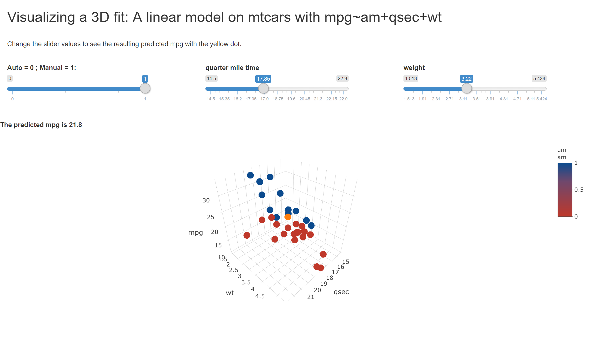

```{r setup, include=FALSE}
knitr::opts_chunk$set(echo = FALSE)
require(stats)
require(MuMIn)
require(datasets)
require(plotly)

#library(rmdexamples)
#kmeans_cluster(iris)

data("mtcars")
bestModel <- function(df,dv){
    require(stats)
    require(MuMIn)
    #fits a best model to a multivariable regression problem
    myformula <- paste(dv,"~.",collapse = "")
    full.model <- lm(formula=as.formula(myformula), data=df, na.action = "na.fail")
    result <- dredge(full.model)
    return(get.models(result,subset=1)[[1]])
}
```

This presentation shows the user a 3D visualization of a linear model from the mtcars dataset using the formula: mpg~am+qsec+wt.  This model was chosen by an optimization routine encapsulated in the function:

```r
bestModel <- function(df,dv){
    require(stats)
    require(MuMIn)
    #fits a best model to a multivariable regression problem
    myformula <- paste(dv,"~.",collapse = "")
    full.model <- lm(formula=as.formula(myformula), data=df, na.action = "na.fail")
    result <- dredge(full.model)
    return(get.models(result,subset=1)[[1]])
}
```   
-Inputs: A data frame, and a dependant variable from within the data frame
    
-Outputs: An object of class 'lm' which can then be used in prediction. 

The function uses a function from the R-package 'MuMIn' called dredge() which interates over all the combinations of the independant variables and finds the combination with the best results.

---

###Lets run the code

```{r runit,echo=TRUE}
df <- mtcars
fit <- bestModel(df,"mpg")
summary(fit)
```

---

-Results:

We see that the final model used only "am", "qsec", and "wt" in the final model and obtained an 85% R^2 value!

-Visualization

In the next slide, we will demonstrate the shinyapp found here:
<https://edward-l-may.shinyapps.io/DDP-ELM-visualize3dmodel/>
The 3D plot shows the three variables plotted with the z-axis being MPG.  The yellow dot in the center is the predicted value based on the inputs for the variables from the sliders.

It is fun to watch the predicted values stay within the cluster of the other data values.

---


